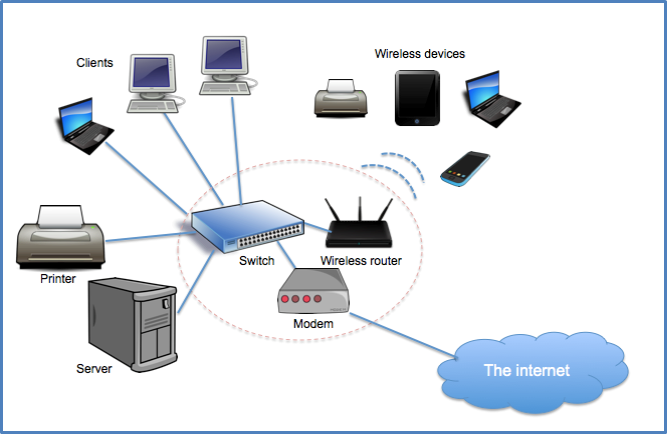

# Computer Networking
## Link
[Computer networking playlist](https://www.youtube.com/playlist?list=PL6gx4Cwl9DGBpuvPW0aHa7mKdn_k9SPKO)  
## What is a Computer Network
 
- network 

## Type of network
### reach/size
- LAN - local area network  
- MAN - meropolis area network  
- WAN - wire area network
### LAN
all computer are in the same building.  
the computer are enclose to each other.  
the building maybe a house or a school.
the devices are connected with cable or wireless.
